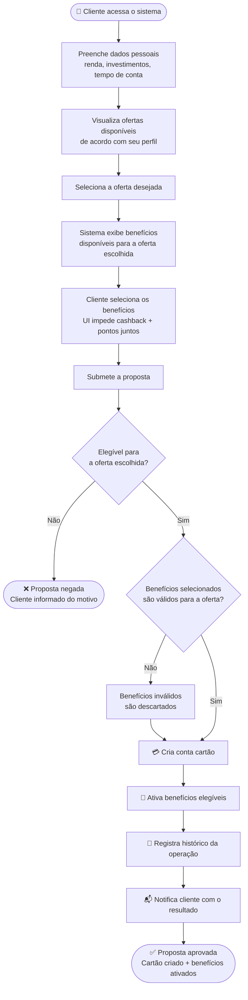
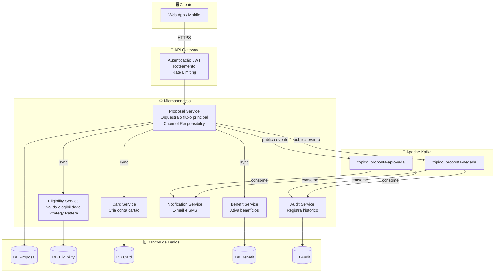
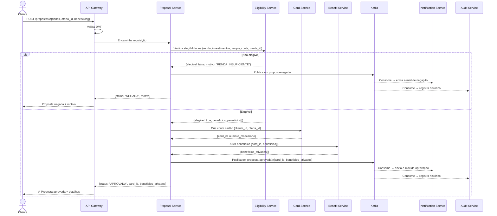
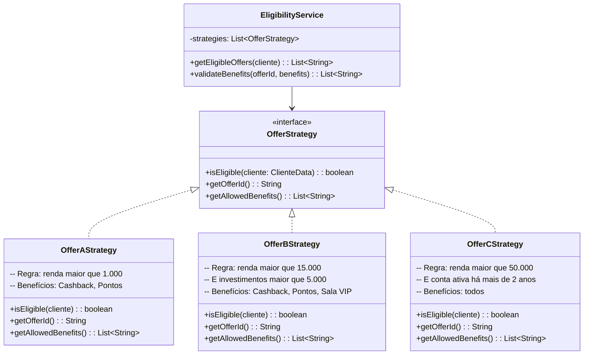
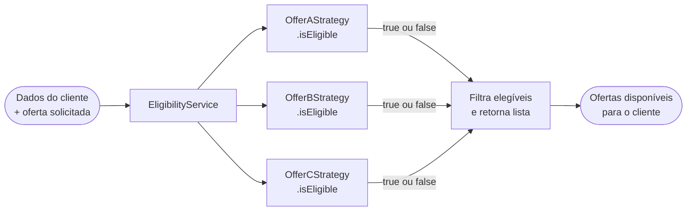
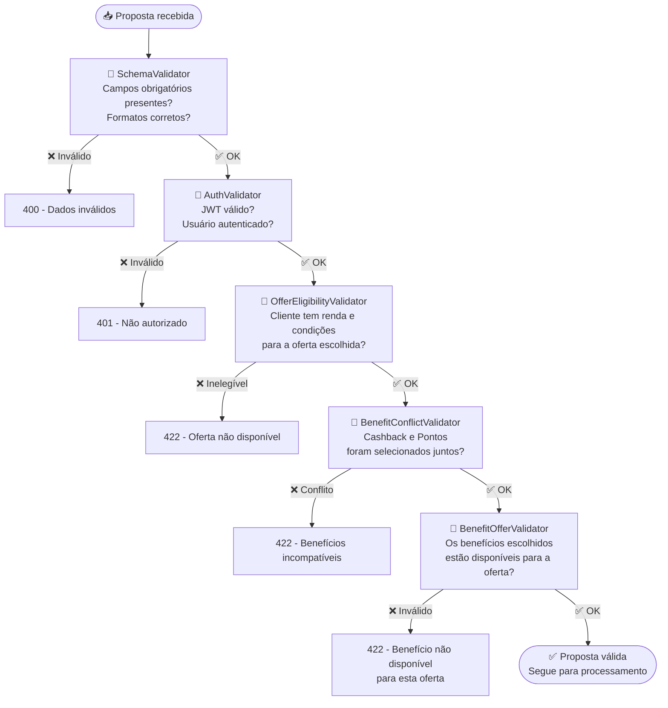
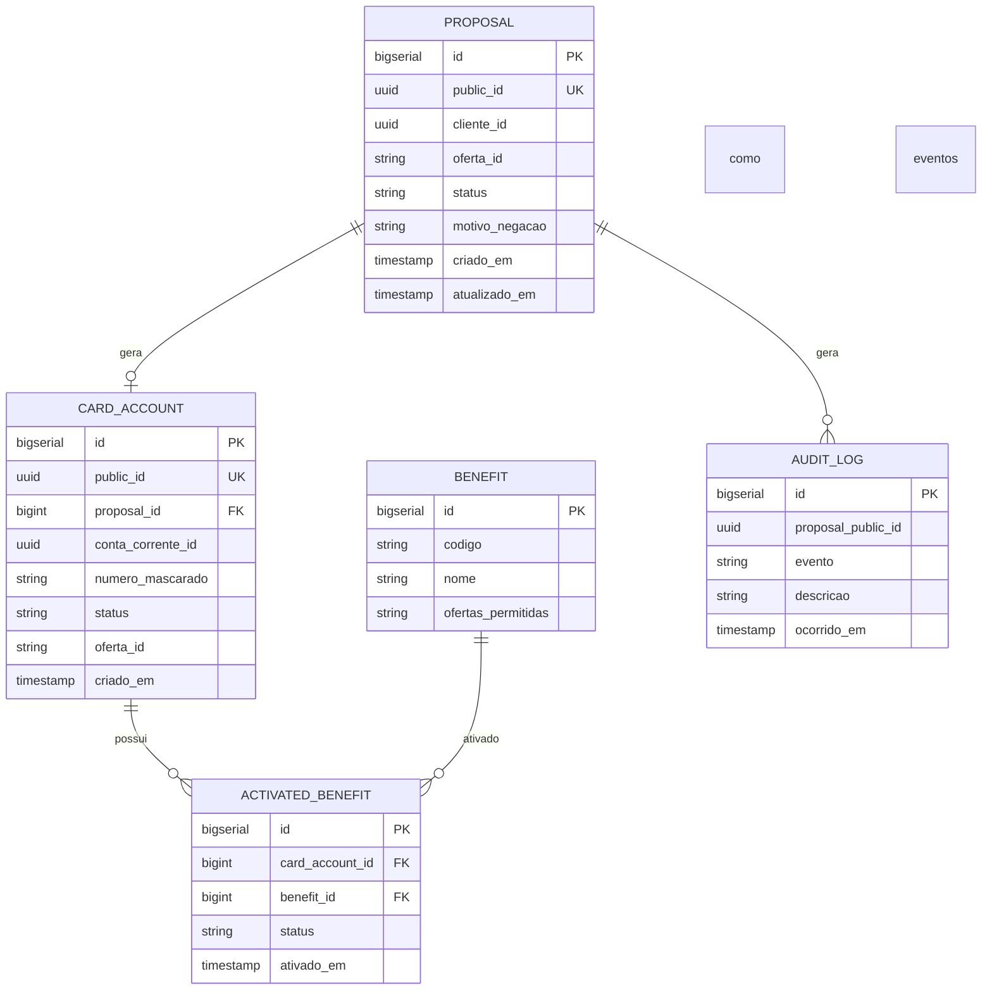
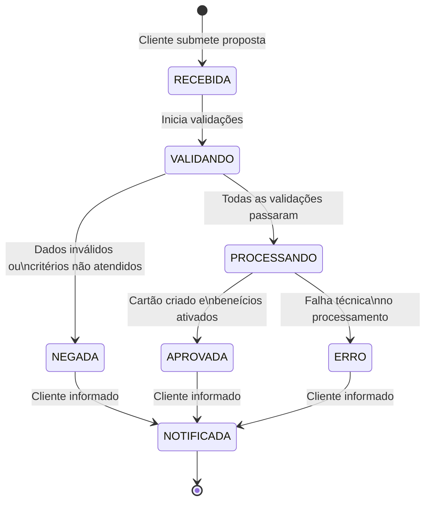

# 📐 Arquitetura de Solução — Diagramas

---

## Índice

1. [Fluxo da Jornada do Usuário](#1-fluxo-da-jornada-do-usuário)
2. [Arquitetura de Microsserviços](#2-arquitetura-de-microsserviços)
3. [Diagrama de Sequência](#3-diagrama-de-sequência)
4. [Strategy Pattern — Elegibilidade](#4-strategy-pattern--elegibilidade)
5. [Chain of Responsibility — Validação](#5-chain-of-responsibility--validação)
6. [Modelo de Dados](#6-modelo-de-dados)
7. [Estados da Proposta](#7-estados-da-proposta)

---

## 1. Fluxo da Jornada do Usuário

> **Tipo:** Fluxograma de negócio  
> **Propósito:** Jornada completa do cliente do início ao resultado.  
> **Decisão de design:** Validação de elegibilidade acontece antes de qualquer criação de recurso — se o cliente não for elegível, nenhuma conta é criada desnecessariamente.

---

## 2. Arquitetura de Microsserviços

> **Tipo:** Diagrama de componentes  
> **Propósito:** Visão dos serviços, responsabilidades e comunicação entre eles.
>
> **Por que microsserviços?**  
> Cada domínio — elegibilidade, cartão e benefícios — tem regras de negócio distintas e podem evoluir em ritmos diferentes. Separar em serviços independentes facilita manutenção e permite que cada um escale conforme sua demanda.
>
> **Por que Kafka?**  
> Notificação e registro de histórico não precisam acontecer antes de responder ao cliente. Publicar um evento no Kafka libera a resposta imediatamente e esses serviços processam no próprio ritmo, sem atrasar a experiência do usuário.

---

## 3. Diagrama de Sequência

> **Tipo:** Sequence Diagram  
> **Propósito:** Ordem das chamadas entre os serviços ao longo do tempo.  
> **Ponto de atenção:** Notificação e auditoria são **assíncronas** — o cliente recebe a resposta sem precisar esperar por elas.

---

## 4. Strategy Pattern — Elegibilidade

> **Padrão:** Strategy (GoF — Comportamental)  
> **Onde:** `Eligibility Service`  
> **Problema resolvido:** Cada oferta tem critérios diferentes. Sem esse padrão, o código viraria um `if/else` enorme difícil de manter. Com Strategy, cada oferta é uma classe isolada com sua própria regra.  
> **Vantagem prática:** Quando surgir uma Oferta D, basta criar uma nova classe — sem alterar nenhuma regra existente. Isso segue o princípio **Open/Closed do SOLID**: aberto para extensão, fechado para modificação.

**Como funciona na prática:**

---

## 5. Chain of Responsibility — Validação

> **Padrão:** Chain of Responsibility (GoF — Comportamental)  
> **Onde:** `Proposal Service` — antes de iniciar qualquer processamento  
> **Problema resolvido:** A proposta precisa passar por várias validações diferentes. Colocar tudo num único método mistura responsabilidades e dificulta manutenção. Com esse padrão, cada validação é independente e pode barrar o fluxo sem que as outras precisem saber.  
> **Vantagem prática:** Para adicionar uma nova validação, basta criar um novo handler e encadear — sem mexer nos existentes.

---

## 6. Modelo de Dados

> **Tipo:** Diagrama Entidade-Relacionamento  
> **Decisão:** Cada microsserviço tem seu próprio banco — evita acoplamento entre serviços e permite que cada um evolua sua estrutura de dados de forma independente.  
> **Nota sobre IDs:** Cada tabela usa `BIGSERIAL` como chave primária interna (joins e índices) e `UUID` como identificador externo exposto na API — veja [ADR-004](decisions/ADR-004-uuid-strategy.md)

---

## 7. Estados da Proposta

> **Tipo:** Diagrama de estados  
> **Propósito:** Ciclo de vida de uma proposta do recebimento ao resultado final.

---

*Os diagramas são renderizados automaticamente pelo GitHub.*  
*Para visualização isolada, use o [Mermaid Live Editor](https://mermaid.live).*
